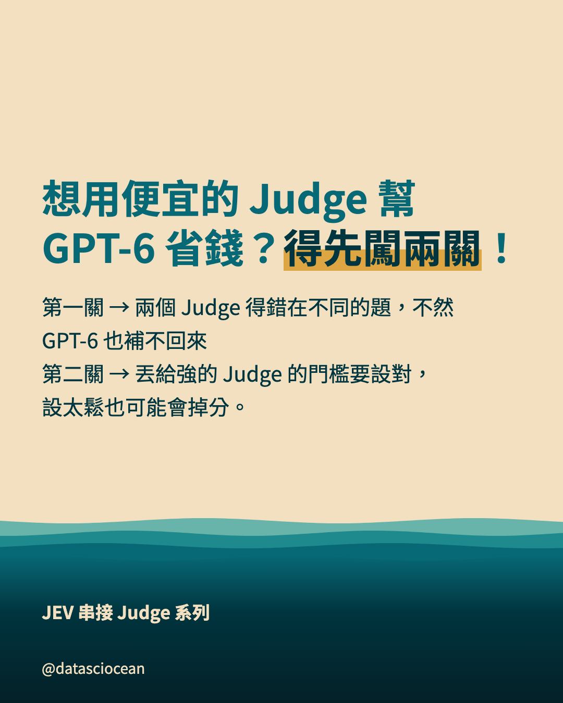
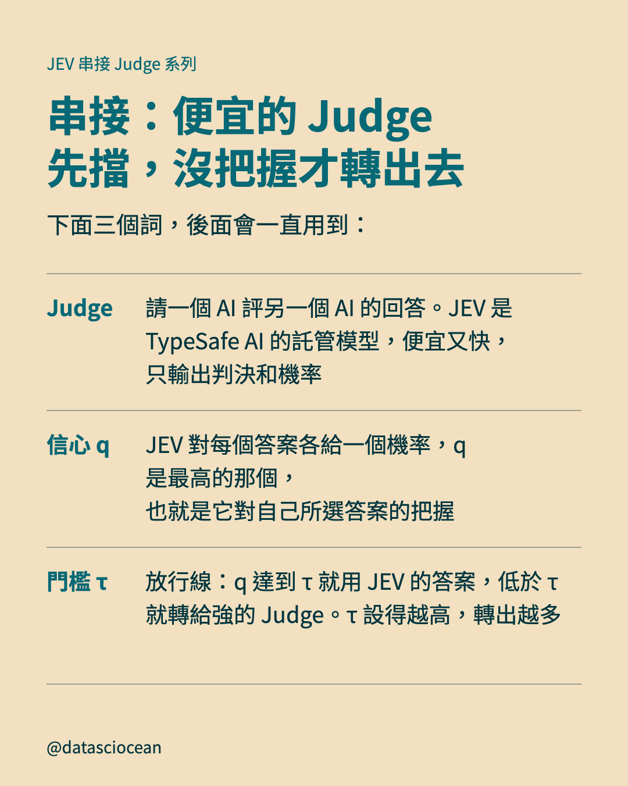
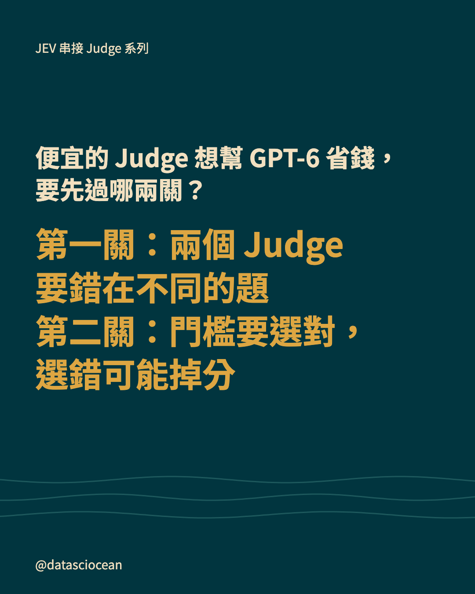
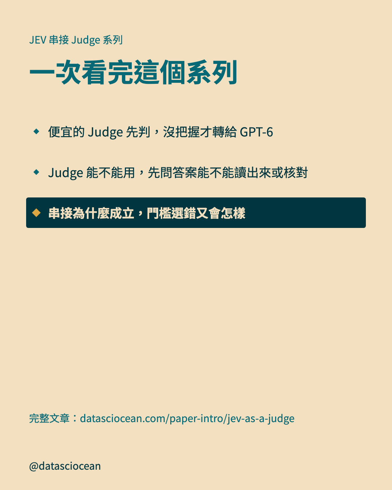

# IG 輪播：串接為什麼成立，門檻選錯又會怎樣

- 系列：JEV 串接 Judge 系列　｜　hook 樣態：情境痛點　｜　共 10 張，**依頁碼順序上傳**
- 每頁下方的「替代文字」貼到 IG 的替代文字欄；最後的 Caption 整段貼上

## 第 1 頁（封面）



- **主標**：想用便宜的 Judge 幫 GPT-6 省錢？得先闖兩關！
- **副標**：第一關 → 兩個 Judge 得錯在不同的題，不然 GPT-6 也補不回來
第二關 → 丟給強的 Judge 的門檻要設對，設太鬆也可能會掉分。
- **替代文字**：想用便宜的 Judge 幫 GPT-6 省錢？得先闖兩關！。第一關 → 兩個 Judge 得錯在不同的題，不然 GPT-6 也補不回來
第二關 → 丟給強的 Judge 的門檻要設對，設太鬆也可能會掉分。

## 第 2 頁（脈絡）



- **主標**：串接：便宜的 Judge 先擋，沒把握才轉出去
- **補充**：下面三個詞，後面會一直用到：
- **表列**：Judge｜請一個 AI 評另一個 AI 的回答。JEV 是 TypeSafe AI 的託管模型，便宜又快，只輸出判決和機率
- **表列**：信心 q｜JEV 對每個答案各給一個機率，q 是最高的那個，也就是它對自己所選答案的把握
- **表列**：門檻 τ｜放行線：q 達到 τ 就用 JEV 的答案，低於 τ 就轉給強的 Judge。τ 設得越高，轉出越多
- **替代文字**：串接：便宜的 Judge 先擋，沒把握才轉出去。下面三個詞，後面會一直用到：

## 第 3 頁（對照表）


- **小標籤**：第一關
- **主標**：第一關：兩個 Judge 要錯在不同的題
- **補充**：串接能成立的前提：兩個 Judge 要錯在不同的題，這樣轉出去才補得回來。
- **表列**：錯在不同的題｜便宜的 Judge 答錯的題，強的 Judge 大多答對，轉出去就能補回來
- **表列**：兩邊都錯｜兩個 Judge 剛好栽在同一題，轉給強的 Judge 也還是錯，怎麼轉都修不回來
- **表列**：天花板｜所以串接的上限，看的是「兩邊共同錯的題有幾題」，不是強的 Judge 自己有多準
- **圖註**：提醒：串接有很多種設計，論文只實測了這一種，這則講的就是它
- **替代文字**：第一關：兩個 Judge 要錯在不同的題。串接能成立的前提：兩個 Judge 要錯在不同的題，這樣轉出去才補得回來。

## 第 4 頁（橫條圖）


- **小標籤**：第一關
- **主標**：共同錯只有 15 題，串接上限比 GPT-6 還高
- **補充**：如果有個完美的挑題員，每題都挑到比較對的那一個，準確度可達 95.7%，高於 GPT-6 單獨的約 93%。但這只是上限，不是實際分流的結果。
- **圖上項目**：JEV 答錯（350 題裡）＝ 75 題
- **圖上項目**：其中 GPT-6 答對（）＝ 60 題
- **圖上項目**：兩邊共同錯（轉也修不回來）＝ 15 題　★強調
- **圖註**：JudgeBench 全部 350 題（原順序判斷）
- **替代文字**：共同錯只有 15 題，串接上限比 GPT-6 還高。如果有個完美的挑題員，每題都挑到比較對的那一個，準確度可達 95.7%，高於 GPT-6 單獨的約 93%。但這只是上限，不是實際分流的結果。

## 第 5 頁（對照表）


- **小標籤**：第一關
- **主標**：實測：換一份題庫，省錢的程度差很多
- **補充**：RewardBench 與 JudgeBench 是兩組不同的題目。費用以 GPT-6 單獨為 100%；JudgeBench 這裡用的是留作驗收的 270 題。
- **表列**：RewardBench｜只轉 25% 的題｜費用只要 27%，準確度還稍微贏過 GPT-6（多 1.27%）
- **表列**：JudgeBench｜要轉 65% 的題｜費用 67%，只省了三分之一；準確度和 GPT-6 看不出差別，是因為 65% 的題交給了 GPT-6 重判
- **表列**：略勝的原因｜兩個 Judge 錯在不同的題，串接等於各挑了擅長的部分
- **替代文字**：實測：換一份題庫，省錢的程度差很多。RewardBench 與 JudgeBench 是兩組不同的題目。費用以 GPT-6 單獨為 100%；JudgeBench 這裡用的是留作驗收的 270 題。

## 第 6 頁（對照表）


- **小標籤**：第二關
- **主標**：第二關：門檻 τ 不能照抄，要自己重選
- **補充**：換掉便宜的 Judge、強的 Judge 或任務，τ 都要用自己有標準答案的題重選。
- **表列**：怎麼選｜拿有標準答案的題把串接模擬一遍，挑「最省錢、準確度比強的 Judge 單獨掉不超過 2%」的 τ
- **表列**：誰決定｜「可以掉 2%」是使用者自己訂的容忍度，不是模型替你算出來的
- **表列**：論文的做法｜試 7 個候選值（0.5 到 0.99），用 96 題挑好就固定。對 GPT-6 挑到 τ = 0.9
- **替代文字**：第二關：門檻 τ 不能照抄，要自己重選。換掉便宜的 Judge、強的 Judge 或任務，τ 都要用自己有標準答案的題重選。

## 第 7 頁（橫條圖）


- **小標籤**：第二關
- **主標**：門檻選對，失敗時只變貴、不掉分
- **補充**：後兩個是 JEV 本來就弱的新任務，準確度和 GPT-6 完全一致，代價是費用接近 GPT-6 單獨。小字是準確度（串接減 GPT-6）。
- **圖上項目**：RewardBench（準確度 +1.27%）＝ 轉給 GPT-6 的題數比例 25 %；費用（GPT-6 單獨 = 100%） 27 %
- **圖上項目**：JudgeBench（準確度 −0.74%）＝ 轉給 GPT-6 的題數比例 65 %；費用（GPT-6 單獨 = 100%） 67 %
- **圖上項目**：PPE（準確度和 GPT-6 一致）＝ 轉給 GPT-6 的題數比例 68 %；費用（GPT-6 單獨 = 100%） 69 %
- **圖上項目**：JudgeBench Claude（準確度和 GPT-6 一致）＝ 轉給 GPT-6 的題數比例 89 %；費用（GPT-6 單獨 = 100%） 91 %
- **圖註**：對照組是低推理強度的 GPT-6，不是它的最強設定
- **替代文字**：門檻選對，失敗時只變貴、不掉分。後兩個是 JEV 本來就弱的新任務，準確度和 GPT-6 完全一致，代價是費用接近 GPT-6 單獨。小字是準確度（串接減 GPT-6）。

## 第 8 頁（對照表）


- **小標籤**：第二關
- **主標**：門檻設太鬆，GPT-5.6 Sol 就掉分了
- **補充**：同一套規則，換成 GPT-5.6 Sol 就出事了：在 JudgeBench 上，串接的準確度比它單獨作答還低。
- **表列**：沒出事｜GPT-5.4、GPT-6 各挑到 τ = 0.90，串接跟自己單獨比，差距在 −0.74% 到 +1.27% 之間
- **表列**：出事了｜GPT-5.6 Sol 挑到較鬆的 τ = 0.70，在 JudgeBench 掉了 4.81%，超過說好的 2% 容忍度
- **表列**：為什麼｜論文說：挑 τ 的 96 題裡只有 32 題是 JudgeBench，其餘是放寬很安全的 RewardBench，所以選到偏鬆的 τ
- **替代文字**：門檻設太鬆，GPT-5.6 Sol 就掉分了。同一套規則，換成 GPT-5.6 Sol 就出事了：在 JudgeBench 上，串接的準確度比它單獨作答還低。

## 第 9 頁（帶走）



- **先問的問題**：便宜的 Judge 想幫 GPT-6 省錢，要先過哪兩關？
- **一句話**：第一關：兩個 Judge 要錯在不同的題
第二關：門檻要選對，選錯可能掉分
- **替代文字**：便宜的 Judge 想幫 GPT-6 省錢，要先過哪兩關？　第一關：兩個 Judge 要錯在不同的題
第二關：門檻要選對，選錯可能掉分

## 第 10 頁（系列地圖）



- **主標**：一次看完這個系列
- **導流行**：完整文章：datasciocean.com/paper-intro/jev-as-a-judge
- **替代文字**：一次看完這個系列。便宜的 Judge 先判，沒把握才轉給 GPT-6、Judge 能不能用，先問答案能不能讀出來或核對、串接為什麼成立，門檻選錯又會怎樣

## Caption（整段貼到 IG）

```text
LLM Judge 串接怎麼設計：便宜的 Judge 先判、GPT-6 補位，什麼條件下才省錢？

・第一關：兩個 Judge 要錯在不同的題
・第一關：共同錯只有 15 題，串接上限比 GPT-6 還高
・第一關：實測：換一份題庫，省錢的程度差很多
・第二關：門檻 τ 不能照抄，要自己重選
・第二關：門檻選對，失敗時只變貴、不掉分
・第二關：門檻設太鬆，GPT-5.6 Sol 就掉分了

完整文章請在 datasciocean.com 搜尋「便宜判官先判、沒把握才找 GPT-6：JEV 串接真的省錢嗎？」

#DSO_LLMJudge #LLMJudge #LLM評測 #JEV
```
