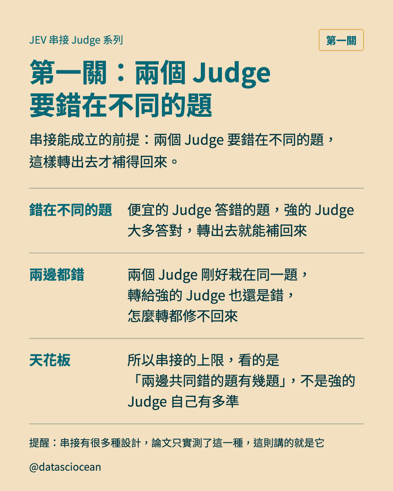
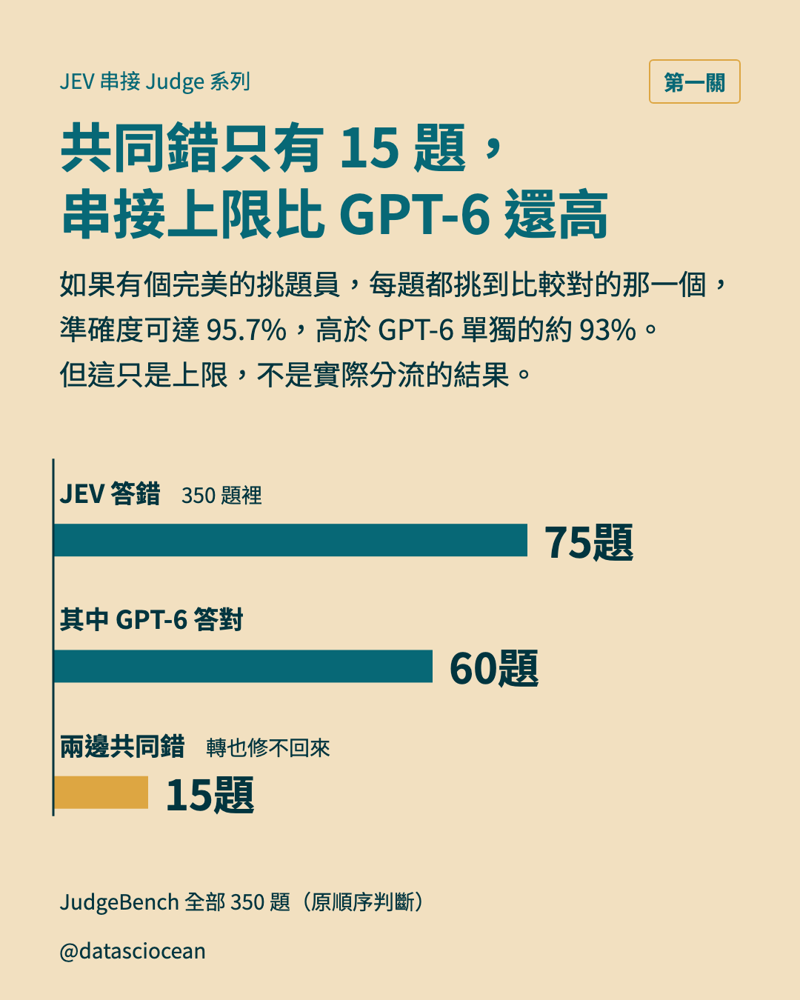
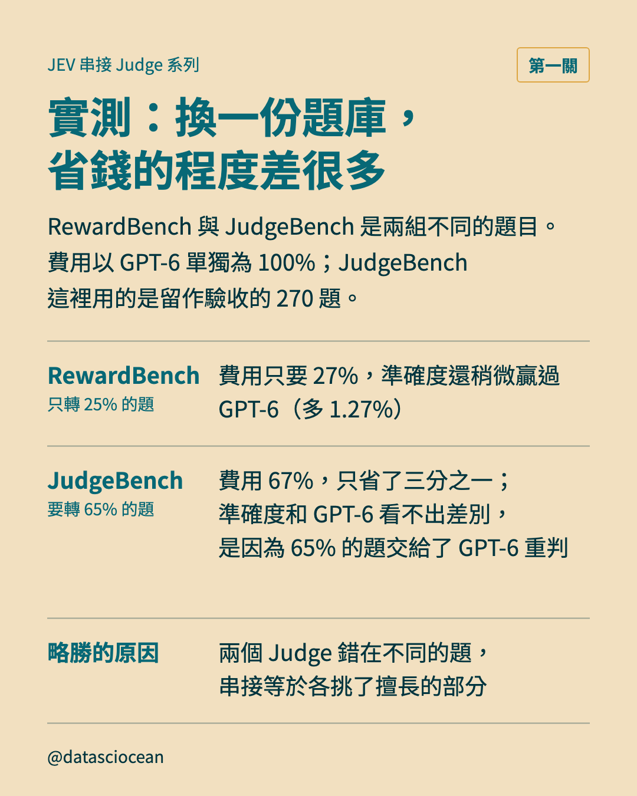
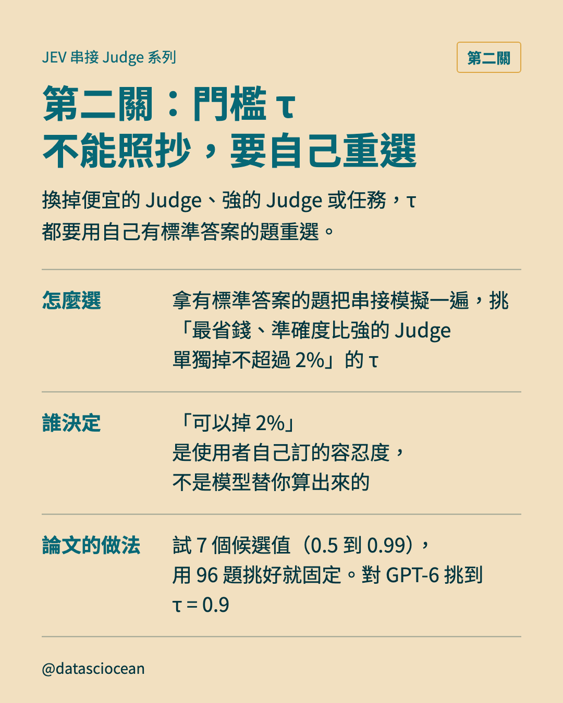
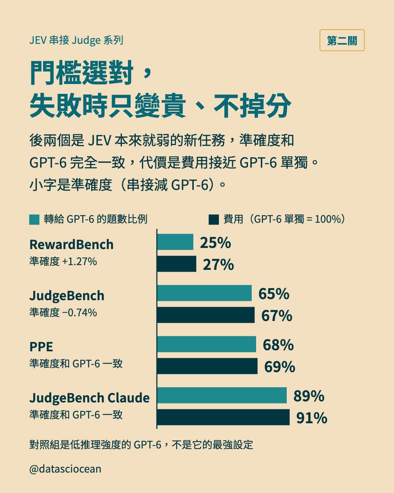
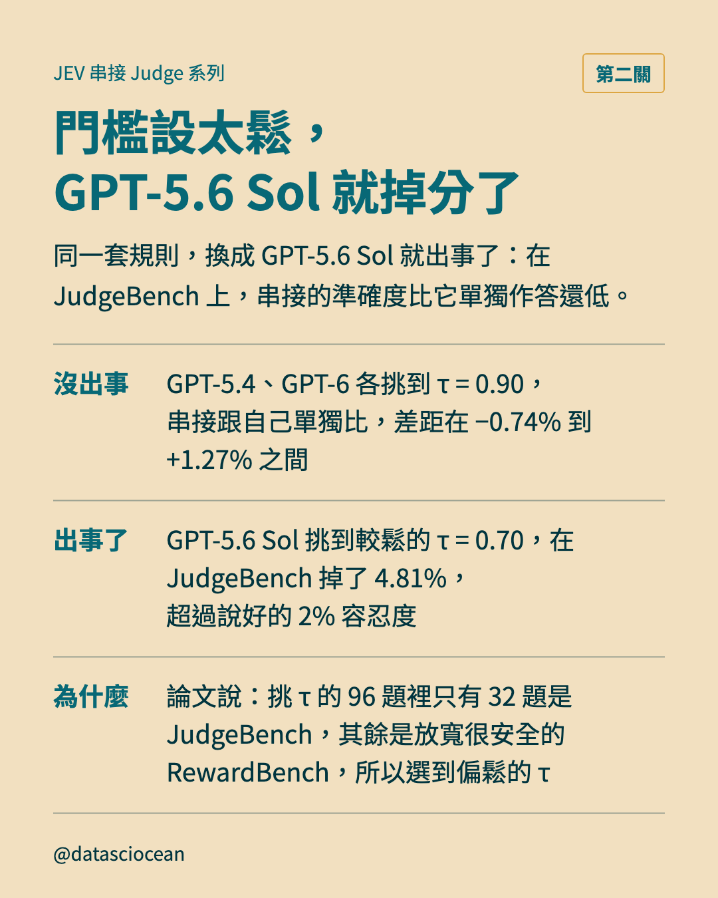

# Threads 串文：串接為什麼成立，門檻選錯又會怎樣

- 發文方式：正文用「新增到串文」**一次發出**，每則串文附下方標註的圖；**連結只放最後一則**（置頂）
- 圖檔在 `../ig/`（與 IG 輪播共用同一套）

## 正文

```text
想用便宜的 Judge 幫 GPT-6 省錢？得先闖兩關！
➡️ 第一關：兩個 Judge 得錯在不同的題，不然 GPT-6 也補不回來
➡️ 第二關：丟給強的 Judge 的門檻要設對，設太鬆也可能會掉分

做法是便宜的 Judge 先判全部的題，沒把握的才轉給強的 Judge。拿 JudgeBench 全部 350 題來看，JEV 錯 75 題，GPT-6 答對其中 60 題，剩下 15 題兩邊都錯，怎麼轉都修不回來。

先說明一下：串接有很多種設計，這裡講的是論文實測的這一種，別的設計論文沒有測。
```

## 串文 1（附圖：第 3 頁）



```text
用考試來想：兩個人如果錯的是同一題，找第二個人來檢查也沒用；兩個人各有各的弱點，才有互補的價值。這也是為什麼評估串接，不能只看強的 Judge 本身多厲害，還要看便宜的 Judge 錯的題，它補得回幾題。
```

## 串文 2（附圖：第 4 頁）



```text
反過來算也對得上：GPT-6 答錯 24 題，JEV 答對其中 9 題，兩邊共同錯的還是那 15 題，就是串接補不回來的部分。95.7% 是有完美挑題員才有的上限，實際分流的成績，看下一張的實測。
```

## 串文 3（附圖：第 5 頁）



```text
先看 RewardBench 略勝的幅度：串接減 GPT-6 是 +1.27%，誤差範圍 [0.45, 2.03]，區間不含 0（整段大於 0），所以這個略勝是真的。不過有兩點要小心。第一，JEV 有沒有事先看過這些測試題當訓練資料，論文並不知道，就像考前有沒有看過考古題一樣，所以「JEV 在 RewardBench 追平 GPT-6」這類結果，無法排除訓練重疊。第二，拿來比的 GPT-6 用的是低推理強度的設定，不是它的最強設定。另外，這張的 JudgeBench 用 270 題，只是第 4 張那 350 題裡留作驗收的一部分，所以準確度數字不同。
```

## 串文 4（附圖：第 6 頁）



```text
為什麼不能照抄？因為 τ 是三樣東西一起決定的：便宜的 Judge、強的 Judge、任務。論文對 GPT-6 選出的 0.9，只是其中一組的答案。
```

## 串文 5（附圖：第 7 頁）



```text
為什麼門檻選對時，失敗只是變貴？因為串接的規矩是 q 低就轉給強的 Judge：JEV 越不確定，轉出的題越多，最後的答案就越接近強的 Judge 單獨作答。兩個新任務是先把流程固定好再測的：每個任務抽 100 題當練習題，用保守的規則挑門檻，再即時跑剩下的題。練習題上 JEV 比 GPT-6 差 12.5%（PPE）和 17%（JudgeBench），所以規則挑了很嚴的門檻，PPE 是 0.95、JudgeBench 是 0.99。這個實驗只說明規則在弱任務上夠嚴、不會掉分，不代表串接在弱任務上很划算。
```

## 串文 6（附圖：第 8 頁）



```text
GPT-5.6 Sol 在 JudgeBench 掉了 4.81%，誤差範圍是 [−8.52, −1.48]，整段都是負的，所以不是運氣。原因是它在 JudgeBench 只轉出 28.5% 的題，漏掉太多 JEV 會錯的題。還有一種例外要小心：沒有證據可以對照的任務，強的 Judge 自己也近乎亂猜，轉出去不會變好，所以「失敗只是變貴」在那裡也不成立。那組任務只有 200 題，論文自己說只能證明結果跟任務有關，不能說差別純粹來自有沒有證據。
```

## 最後一則（置頂）

```text
便宜的 Judge 想幫 GPT-6 省錢，要先過兩關：兩個 Judge 得錯在不同的題，門檻也要用自己的題選對。選對時，失敗只是變貴；選錯，可能掉分。
文章：datasciocean.com/paper-intro/jev-as-a-judge
同系列：便宜的 Judge 先判，沒把握才轉給 GPT-6
https://www.threads.com/@datasciocean/post/DeMHNAeEzm2
同系列：Judge 能不能用，先問答案能不能讀出來或核對
https://www.threads.com/@datasciocean/post/DeNyxyxmAFX
```
