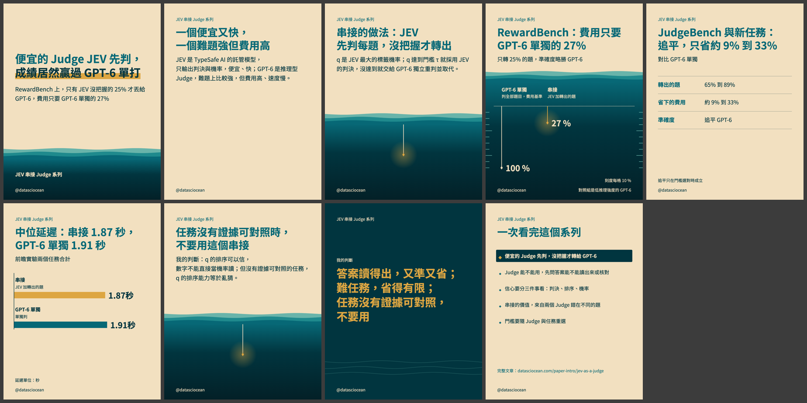

# 便宜的 Judge 先判，沒把握才轉給 GPT-6

| 項目 | 內容 |
|---|---|
| 系列 | JEV 串接 Judge 系列 |
| 觀念 | `jev-cascade-overview`（卡：`concept-wiki/wiki/concepts/jev-cascade-overview.md`） |
| hook 樣態 | 反直覺斷言 |
| IG 輪播 | 待發布（9 張） |
| Threads 串文 | 待發布（7 則） |

## 要看／要發的檔案

| 要做什麼 | 打開哪個檔案 |
|---|---|
| 看 IG 每一頁的圖與文字、複製 caption | [`ig/post.md`](ig/post.md)（圖在 `ig/01.png` …） |
| 看 Threads 串文（正文、每則附圖、最後一則） | [`threads/post.md`](threads/post.md) |
| 一眼看全部縮圖 | 下方縮圖，或 [`_build/contact-sheet.png`](_build/contact-sheet.png) |

## 檢查結果（程式產生）

- 程式 B：9/9 張通過（模板版本 `f5d38e10ed31`）
- 程式 A、批次檢查、忠實者與讀者審查的結果不存在發布包裡（審查產出放暫存，不進 repo）；最後確認時由 Claude 在報告中說明

## 發布前

- [ ] 人最後確認圖、文字、caption
- [ ] IG：手動上傳 `ig/01.png` …，貼 caption，替代文字貼自 `ig/post.md`；**或**用 API：`ig_publish.py prepare` → push `ig/jpg/` → `publish`（dry-run）→ 確認後 `--confirm`（見 references/instagram-publish.md）
- [ ] Threads：正文用「新增到串文」一次發出，每則串文附圖，最後一則（置頂）含文章連結

## 發布後

- [ ] 發限時動態並加連結貼紙，指向文章
- [ ] 收進系列精選集；概覽發布後置頂概覽 post；置頂最後一則 Threads 回覆
- [ ] 把網址與時間交給系統寫回：`state.py record <觀念> <格式> --url … --published-at …`
- [ ] 系列其他則發布後，依 `state/backfill.md` 回補（IG 改 caption；Threads 在原串文下加回覆）

## `_build/`（機器用，不用看）

`spec.json`（內容規格，唯一的真相來源）、`checks-b.json`、`alt-text.json`、`html/`、`post-with-refs.md`、`post-reader.md`、`contact-sheet.png`。
改內容請改 `spec.json` 後重跑 `check_a.py` → `render.py` → `build_package.py`。
