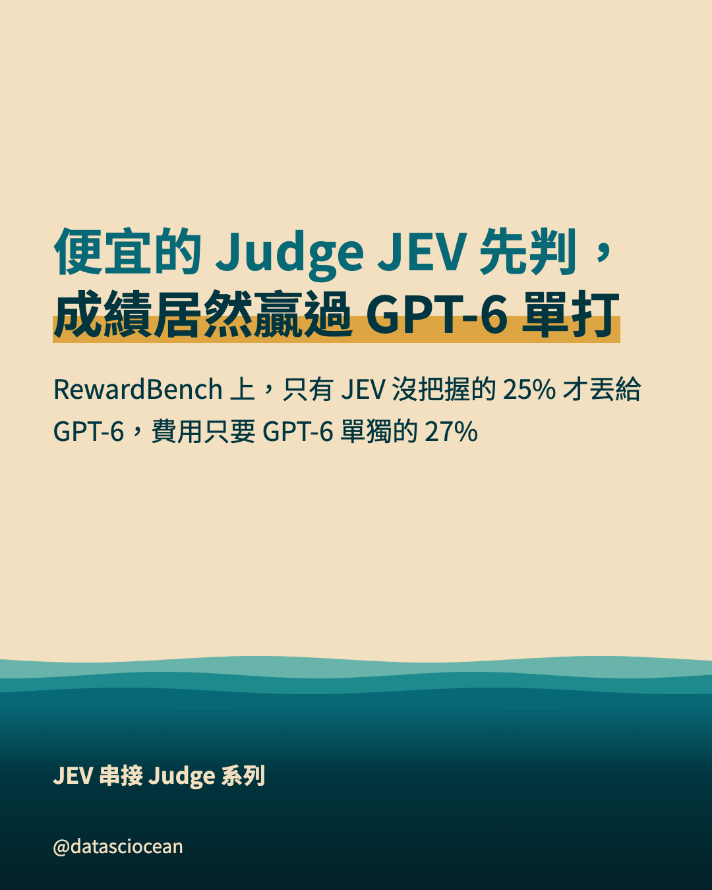
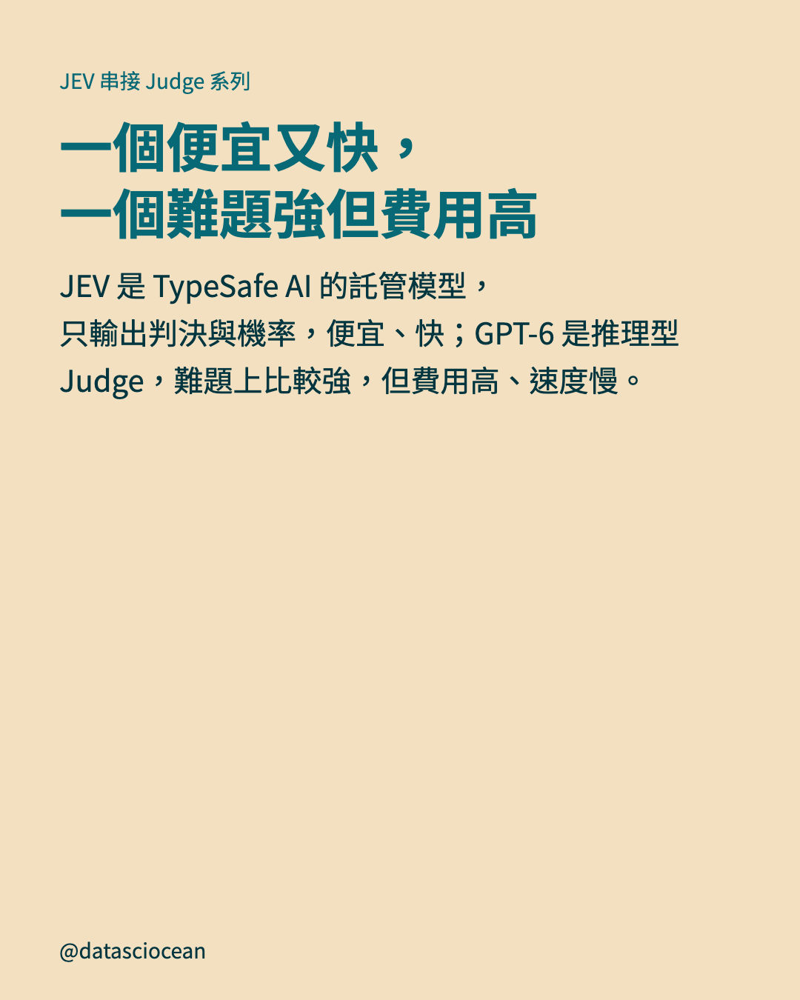
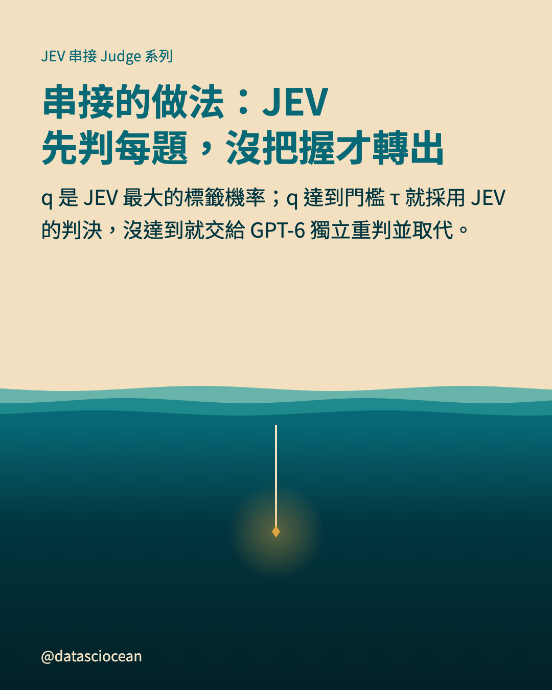
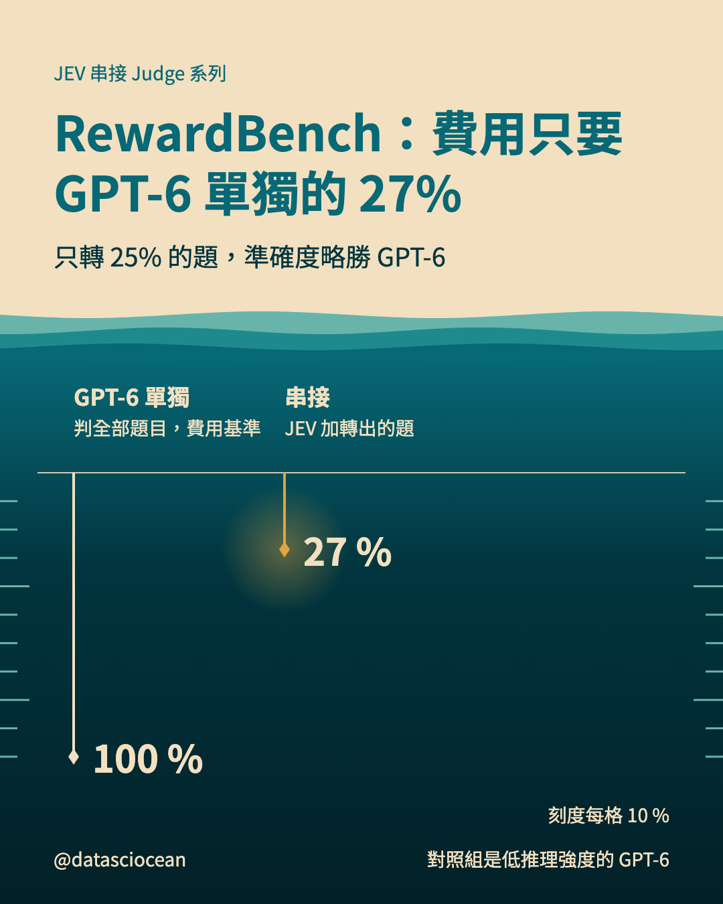
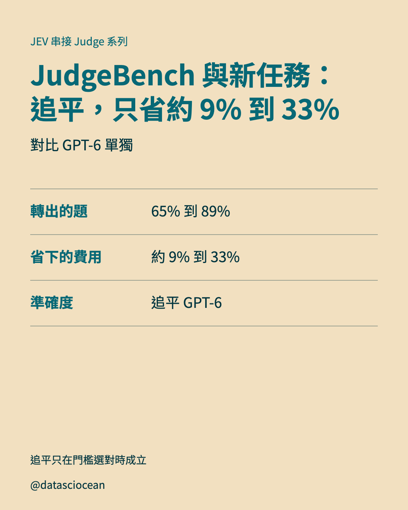
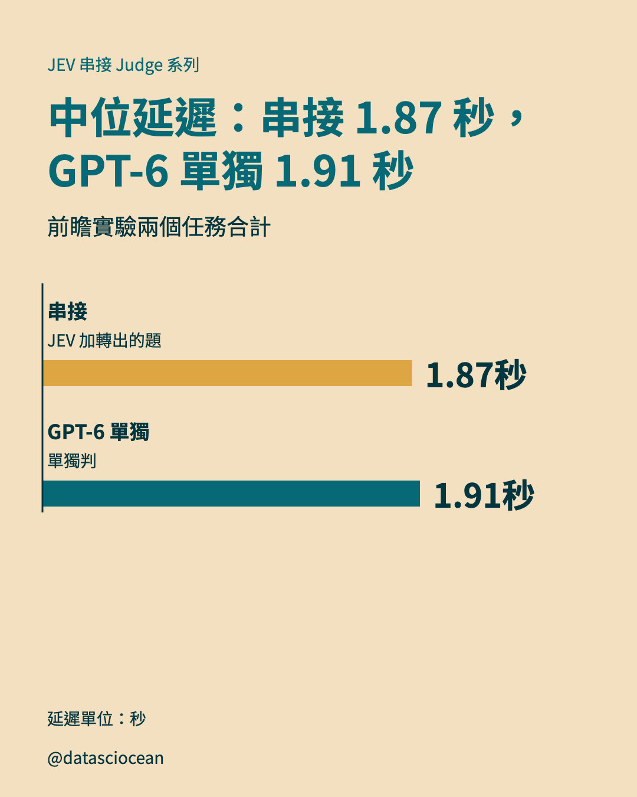
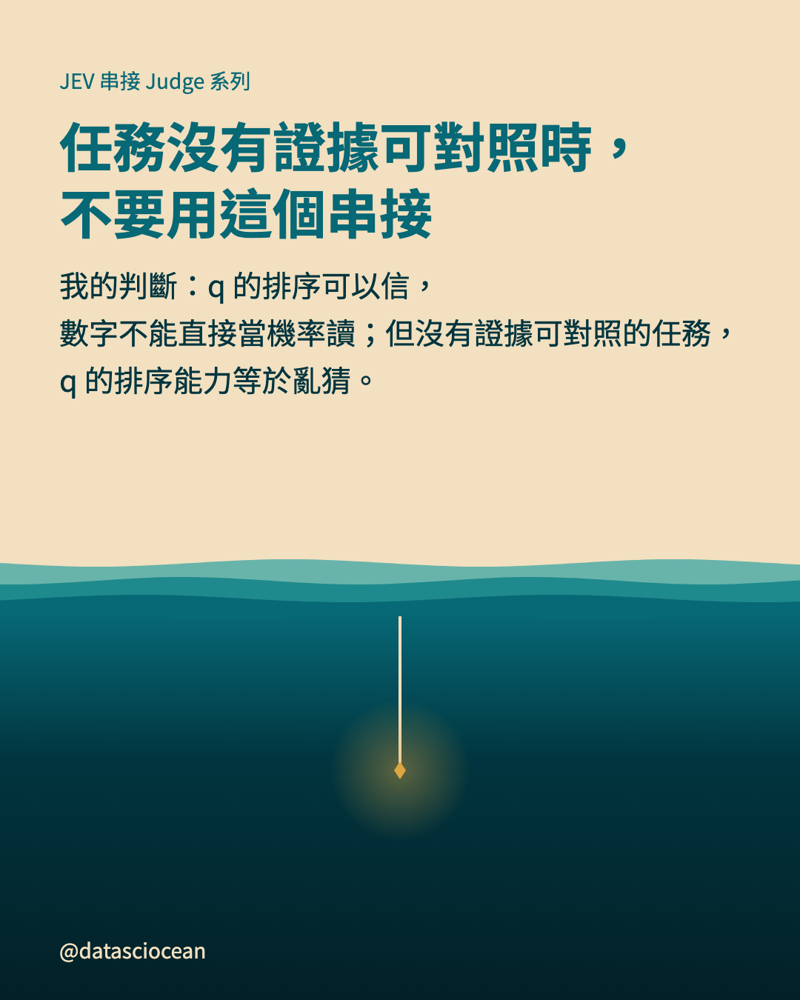
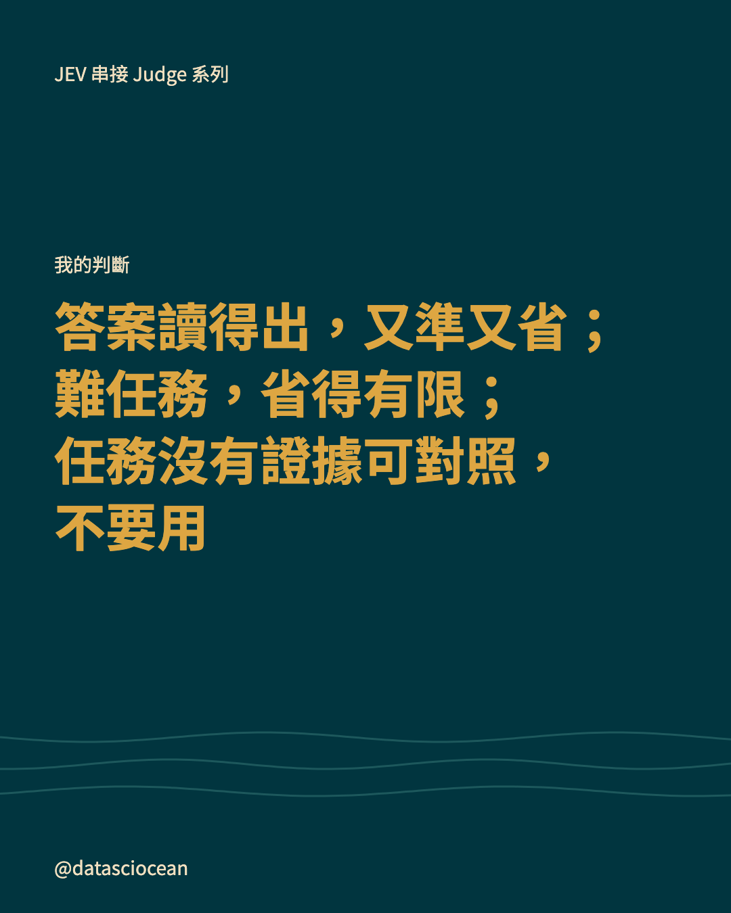
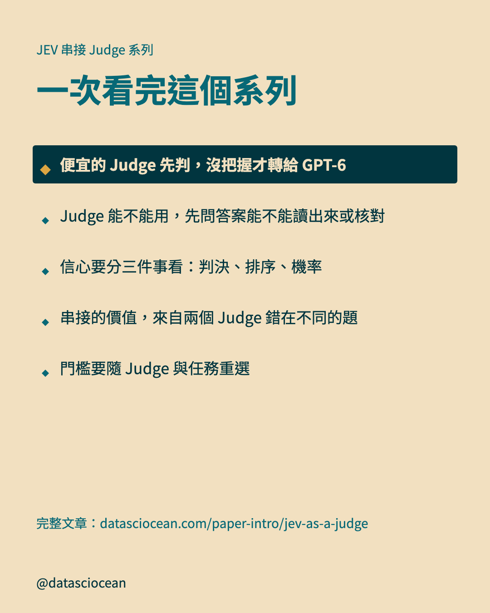

# IG 輪播：便宜的 Judge 先判，沒把握才轉給 GPT-6

- 系列：JEV 串接 Judge 系列　｜　hook 樣態：反直覺斷言　｜　共 9 張，**依頁碼順序上傳**
- 每頁下方的「替代文字」貼到 IG 的替代文字欄；最後的 Caption 整段貼上

## 第 1 頁（封面）



- **主標**：便宜的 Judge JEV 先判，成績居然贏過 GPT-6 單打
- **副標**：RewardBench 上，只有 JEV 沒把握的 25% 才丟給 GPT-6，費用只要 GPT-6 單獨的 27%
- **替代文字**：便宜的 Judge JEV 先判，成績居然贏過 GPT-6 單打。RewardBench 上，只有 JEV 沒把握的 25% 才丟給 GPT-6，費用只要 GPT-6 單獨的 27%

## 第 2 頁（脈絡）



- **主標**：一個便宜又快，一個難題強但費用高
- **補充**：JEV 是 TypeSafe AI 的託管模型，只輸出判決與機率，便宜、快；GPT-6 是推理型 Judge，難題上比較強，但費用高、速度慢。
- **替代文字**：一個便宜又快，一個難題強但費用高。JEV 是 TypeSafe AI 的託管模型，只輸出判決與機率，便宜、快；GPT-6 是推理型 Judge，難題上比較強，但費用高、速度慢。

## 第 3 頁（文字）



- **主標**：串接的做法：JEV 先判每題，沒把握才轉出
- **補充**：q 是 JEV 最大的標籤機率；q 達到門檻 τ 就採用 JEV 的判決，沒達到就交給 GPT-6 獨立重判並取代。
- **替代文字**：串接的做法：JEV 先判每題，沒把握才轉出。q 是 JEV 最大的標籤機率；q 達到門檻 τ 就採用 JEV 的判決，沒達到就交給 GPT-6 獨立重判並取代。

## 第 4 頁（測深圖）



- **主標**：RewardBench：費用只要 GPT-6 單獨的 27%
- **補充**：只轉 25% 的題，準確度略勝 GPT-6
- **圖上項目**：GPT-6 單獨（判全部題目，費用基準）＝ 100 %
- **圖上項目**：串接（JEV 加轉出的題）＝ 27 %　★強調
- **圖註**：對照組是低推理強度的 GPT-6
- **替代文字**：RewardBench：費用只要 GPT-6 單獨的 27%。只轉 25% 的題，準確度略勝 GPT-6

## 第 5 頁（對照表）



- **主標**：JudgeBench 與新任務：追平，只省約 9% 到 33%
- **補充**：對比 GPT-6 單獨
- **表列**：轉出的題｜65% 到 89%
- **表列**：省下的費用｜約 9% 到 33%
- **表列**：準確度｜追平 GPT-6
- **圖註**：追平只在門檻選對時成立
- **替代文字**：JudgeBench 與新任務：追平，只省約 9% 到 33%。對比 GPT-6 單獨

## 第 6 頁（橫條圖）



- **主標**：中位延遲：串接 1.87 秒，GPT-6 單獨 1.91 秒
- **補充**：前瞻實驗兩個任務合計
- **圖上項目**：串接（JEV 加轉出的題）＝ 1.87 秒　★強調
- **圖上項目**：GPT-6 單獨（單獨判）＝ 1.91 秒
- **圖註**：延遲單位：秒
- **替代文字**：中位延遲：串接 1.87 秒，GPT-6 單獨 1.91 秒。前瞻實驗兩個任務合計

## 第 7 頁（文字）



- **主標**：任務沒有證據可對照時，不要用這個串接
- **補充**：我的判斷：q 的排序可以信，數字不能直接當機率讀；但沒有證據可對照的任務，q 的排序能力等於亂猜。
- **替代文字**：任務沒有證據可對照時，不要用這個串接。我的判斷：q 的排序可以信，數字不能直接當機率讀；但沒有證據可對照的任務，q 的排序能力等於亂猜。

## 第 8 頁（帶走）



- **小標籤**：我的判斷
- **一句話**：答案讀得出，又準又省；難任務，省得有限；任務沒有證據可對照，不要用
- **替代文字**：答案讀得出，又準又省；難任務，省得有限；任務沒有證據可對照，不要用

## 第 9 頁（系列地圖）



- **主標**：一次看完這個系列
- **導流行**：完整文章：datasciocean.com/paper-intro/jev-as-a-judge
- **替代文字**：一次看完這個系列。便宜的 Judge 先判，沒把握才轉給 GPT-6、Judge 能不能用，先問答案能不能讀出來或核對、信心要分三件事看：判決、排序、機率、串接的價值，來自兩個 Judge 錯在不同的題、門檻要隨 Judge 與任務重選

## Caption（整段貼到 IG）

```text
LLM Judge 怎麼分工：便宜的 JEV 先判，沒把握才轉給 GPT-6

・串接的做法：JEV 先判每題，沒把握才轉出（q 是 JEV 最大的標籤機率）
・RewardBench：費用只要 GPT-6 單獨的 27%（只轉 25% 的題，準確度略勝 GPT-6）
・JudgeBench 與新任務：追平，只省約 9% 到 33%（對比 GPT-6 單獨）
・中位延遲：串接 1.87 秒，GPT-6 單獨 1.91 秒（前瞻實驗兩個任務合計）
・任務沒有證據可對照時，不要用這個串接（我的判斷：q 的排序可以信，數字不能直接當機率讀）

完整文章請在 datasciocean.com 搜尋「便宜判官先判、沒把握才找 GPT-6：JEV 串接真的省錢嗎？」

#DSO_LLMJudge #LLMJudge #模型串接 #GPT6 #LLM評測
```
