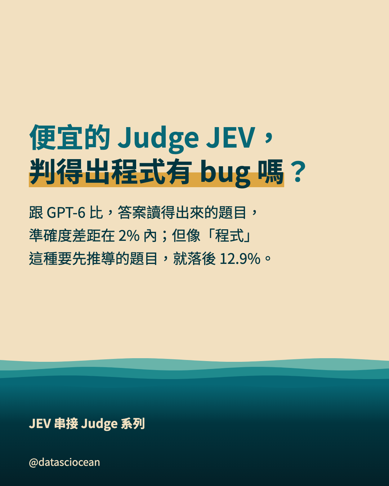
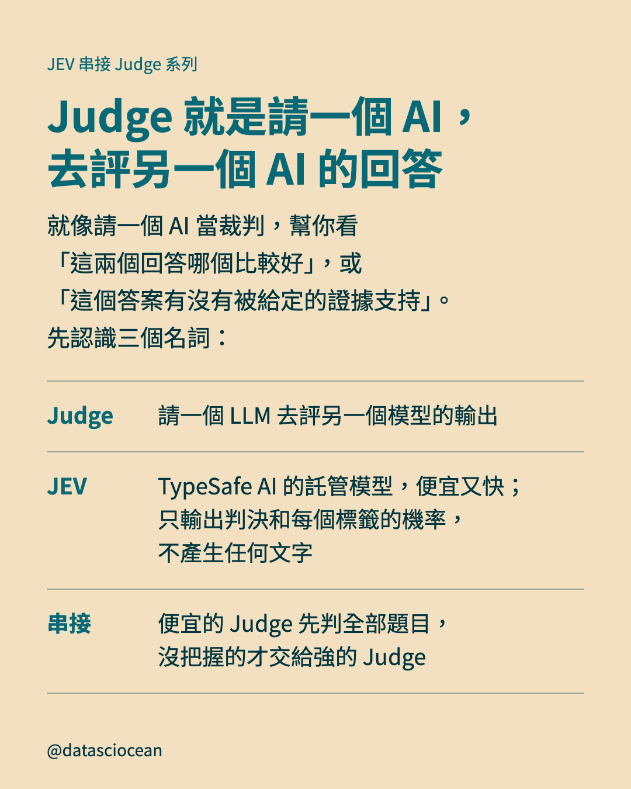
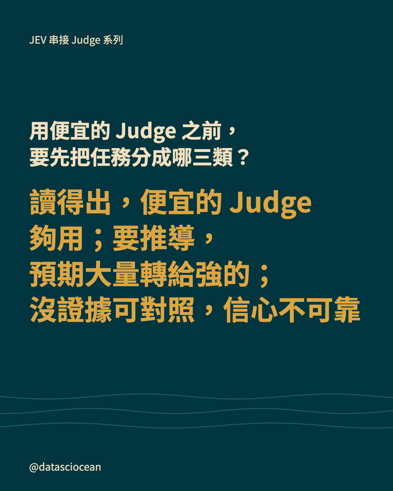
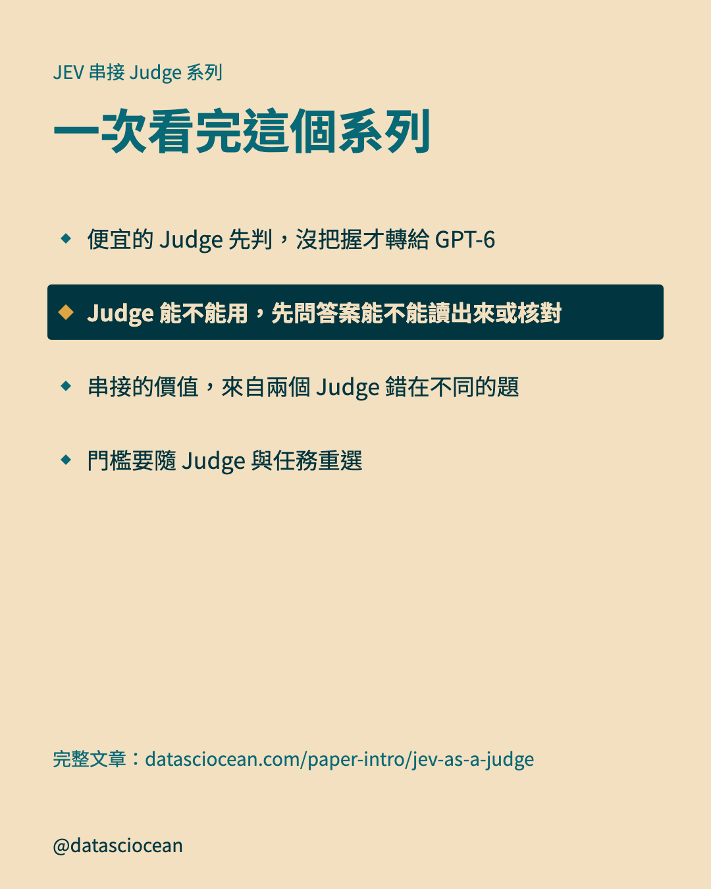

# IG 輪播：Judge 能不能用，先問答案能不能讀出來或核對

- 系列：JEV 串接 Judge 系列　｜　hook 樣態：讀者疑問　｜　共 10 張，**依頁碼順序上傳**
- 每頁下方的「替代文字」貼到 IG 的替代文字欄；最後的 Caption 整段貼上

## 第 1 頁（封面）



- **主標**：便宜的 Judge JEV，判得出程式有 bug 嗎？
- **副標**：跟 GPT-6 比，答案讀得出來的題目，準確度差距在 2% 內；但像「程式」這種要先推導的題目，就落後 12.9%。
- **替代文字**：便宜的 Judge JEV，判得出程式有 bug 嗎？。跟 GPT-6 比，答案讀得出來的題目，準確度差距在 2% 內；但像「程式」這種要先推導的題目，就落後 12.9%。

## 第 2 頁（脈絡）



- **主標**：Judge 就是請一個 AI，去評另一個 AI 的回答
- **補充**：就像請一個 AI 當裁判，幫你看「這兩個回答哪個比較好」，或「這個答案有沒有被給定的證據支持」。先認識三個名詞：
- **表列**：Judge｜請一個 LLM 去評另一個模型的輸出
- **表列**：JEV｜TypeSafe AI 的託管模型，便宜又快；只輸出判決和每個標籤的機率，不產生任何文字
- **表列**：串接｜便宜的 Judge 先判全部題目，沒把握的才交給強的 Judge
- **替代文字**：Judge 就是請一個 AI，去評另一個 AI 的回答。就像請一個 AI 當裁判，幫你看「這兩個回答哪個比較好」，或「這個答案有沒有被給定的證據支持」。先認識三個名詞：

## 第 3 頁（對照表）


- **主標**：Judge 的工作是比對，不是從頭解題
- **補充**：你可以想成改考卷：答案就寫在考卷上，對一對就行，小模型就夠；但要是得自己重新算一遍才知道對不對，小模型就不及。下面兩個例子是自編的：
- **表列**：讀一遍就知道｜「這個回答有沒有拒絕使用者？」答案讀一遍就有了，小模型就夠
- **表列**：腦中執行才知道｜「這段程式有沒有 bug？」得自己重新推導才知道對錯，小模型就不及
- **表列**：選之前先問｜這題的答案，是讀一遍就知道，還是得自己重新推導？
- **替代文字**：Judge 的工作是比對，不是從頭解題。你可以想成改考卷：答案就寫在考卷上，對一對就行，小模型就夠；但要是得自己重新算一遍才知道對不對，小模型就不及。下面兩個例子是自編的：

## 第 4 頁（橫條圖）


- **主標**：要推導的任務，JEV 落後 GPT-6 7.0% 到 27.6%
- **補充**：拿 JEV 跟 GPT-6 比準確度（JEV 減 GPT-6）：答案讀得出的任務，差距在 2% 內；需要自己推導的任務，就落後很多。
- **圖上項目**：知識（）＝ 7 %
- **圖上項目**：程式（）＝ 12.9 %　★強調
- **圖上項目**：數學（）＝ 14.3 %
- **圖上項目**：邏輯謎題（）＝ 27.6 %
- **圖註**：JEV 1.13 版；對照組是低推理強度的 GPT-6
- **替代文字**：要推導的任務，JEV 落後 GPT-6 7.0% 到 27.6%。拿 JEV 跟 GPT-6 比準確度（JEV 減 GPT-6）：答案讀得出的任務，差距在 2% 內；需要自己推導的任務，就落後很多。

## 第 5 頁（橫條圖）


- **主標**：沒有證據可對照時，三個 Judge 都接近丟硬幣
- **補充**：沒有證據可對照，是指 Judge 只拿到問題和回答，手上沒有證據文件或標準答案，要靠自己的知識判斷有沒有胡說。三個 Judge 的準確度都接近丟硬幣，卻都很有把握。
- **圖上項目**：JEV（把握（平均最高機率）0.91）＝ 53.5 %　★強調
- **圖上項目**：GPT-4.1 mini（把握 0.94）＝ 54 %
- **圖上項目**：GPT-5.4（把握 0.96）＝ 56 %
- **圖註**：200 題、二選一，丟硬幣是 50%
- **替代文字**：沒有證據可對照時，三個 Judge 都接近丟硬幣。沒有證據可對照，是指 Judge 只拿到問題和回答，手上沒有證據文件或標準答案，要靠自己的知識判斷有沒有胡說。三個 Judge 的準確度都接近丟硬幣，卻都很有把握。

## 第 6 頁（對照表）


- **主標**：Judge 的信心，要分三件事來看
- **補充**：準確度、排序、數字大小，量的是不同的東西，所以一個 Judge 可以其中一項很好、另一項很差。三件事各有對應的指標：
- **表列**：判決｜準確度｜它的判決，到底對不對？
- **表列**：排序｜AUROC｜它沒把握的題，是不是真的比較常錯？
- **表列**：數字大小｜Brier、NLL｜它說有 90% 把握，真的約有 90% 答對嗎？（校準）
- **替代文字**：Judge 的信心，要分三件事來看。準確度、排序、數字大小，量的是不同的東西，所以一個 Judge 可以其中一項很好、另一項很差。三件事各有對應的指標：

## 第 7 頁（橫條圖）


- **主標**：沒有證據可對照時，JEV 的信心排不出誰會錯
- **補充**：AUROC 是在量「排序」：把題目照信心從低排到高，信心有用的話，答錯的題應該排在前面。講白一點，就是隨機抽一題答錯、一題答對，答錯那題信心比較低的機率。
- **圖上項目**：完美（AUROC 最高分）＝ 1 
- **圖上項目**：亂猜（）＝ 0.5 
- **圖上項目**：JEV（這 200 題）＝ 0.498 　★強調
- **圖註**：AUROC：0.5 等於亂猜，1 等於完美
- **替代文字**：沒有證據可對照時，JEV 的信心排不出誰會錯。AUROC 是在量「排序」：把題目照信心從低排到高，信心有用的話，答錯的題應該排在前面。講白一點，就是隨機抽一題答錯、一題答對，答錯那題信心比較低的機率。

## 第 8 頁（對照表）


- **主標**：沒有證據可對照時，用信心分流會失效
- **補充**：串接靠的是「沒把握的才轉給強的 Judge」。這個做法能成立，前提是信心低的題比較容易錯。我們來看這個前提在這 200 題成不成立：
- **表列**：分流的前提｜信心低的題，比較容易錯
- **表列**：這 200 題｜信心都很高，而且高低跟對錯無關
- **表列**：所以｜沒有任何門檻能把該轉的題挑出來
- **表列**：就算轉出去｜強的 Judge GPT-5.4 也只有 56%，丟硬幣是 50%
- **替代文字**：沒有證據可對照時，用信心分流會失效。串接靠的是「沒把握的才轉給強的 Judge」。這個做法能成立，前提是信心低的題比較容易錯。我們來看這個前提在這 200 題成不成立：

## 第 9 頁（帶走）



- **先問的問題**：用便宜的 Judge 之前，要先把任務分成哪三類？
- **一句話**：讀得出，便宜的 Judge 夠用；要推導，預期大量轉給強的；沒證據可對照，信心不可靠
- **替代文字**：用便宜的 Judge 之前，要先把任務分成哪三類？　讀得出，便宜的 Judge 夠用；要推導，預期大量轉給強的；沒證據可對照，信心不可靠

## 第 10 頁（系列地圖）



- **主標**：一次看完這個系列
- **導流行**：完整文章：datasciocean.com/paper-intro/jev-as-a-judge
- **替代文字**：一次看完這個系列。便宜的 Judge 先判，沒把握才轉給 GPT-6、Judge 能不能用，先問答案能不能讀出來或核對、串接的價值，來自兩個 Judge 錯在不同的題、門檻要隨 Judge 與任務重選

## Caption（整段貼到 IG）

```text
LLM Judge 怎麼選：便宜的 JEV 在哪些題目上跟 GPT-6 差多少？

・Judge 的工作是比對，不是從頭解題
・要推導的任務，JEV 落後 GPT-6 7.0% 到 27.6%
・沒有證據可對照時，三個 Judge 都接近丟硬幣
・Judge 的信心，要分三件事來看
・沒有證據可對照時，JEV 的信心排不出誰會錯
・沒有證據可對照時，用信心分流會失效（串接靠的是「沒把握的才轉給強的 Judge」）

完整文章請在 datasciocean.com 搜尋「便宜判官先判、沒把握才找 GPT-6：JEV 串接真的省錢嗎？」

#DSO_LLMJudge #LLMJudge #LLM評測 #JEV
```
