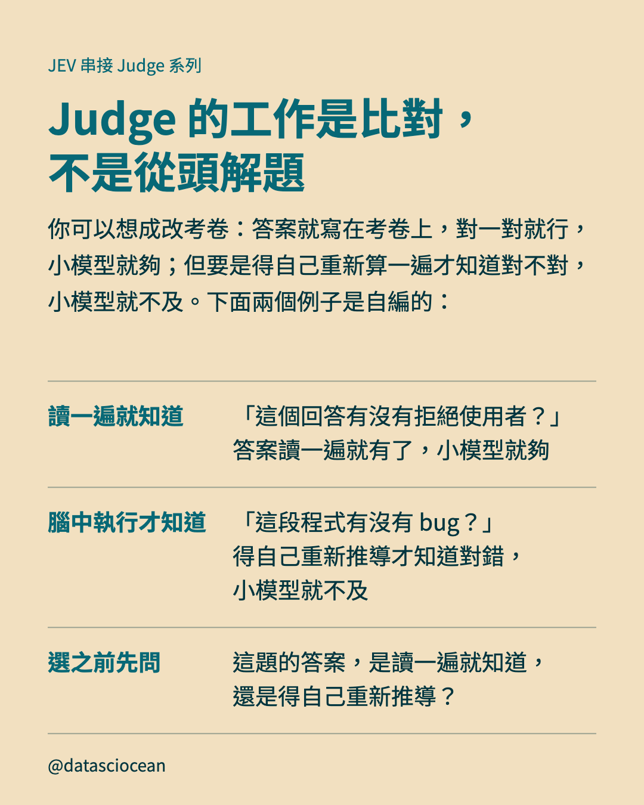
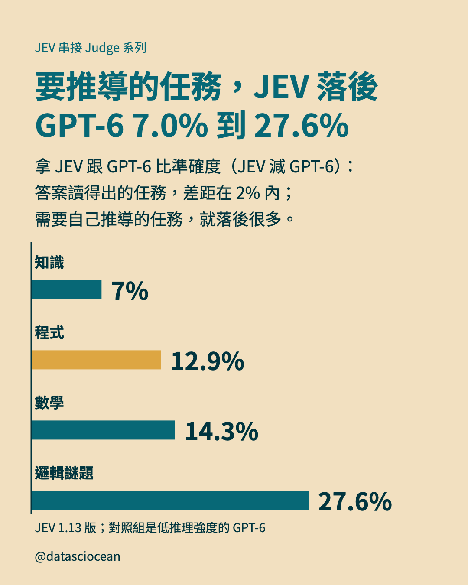
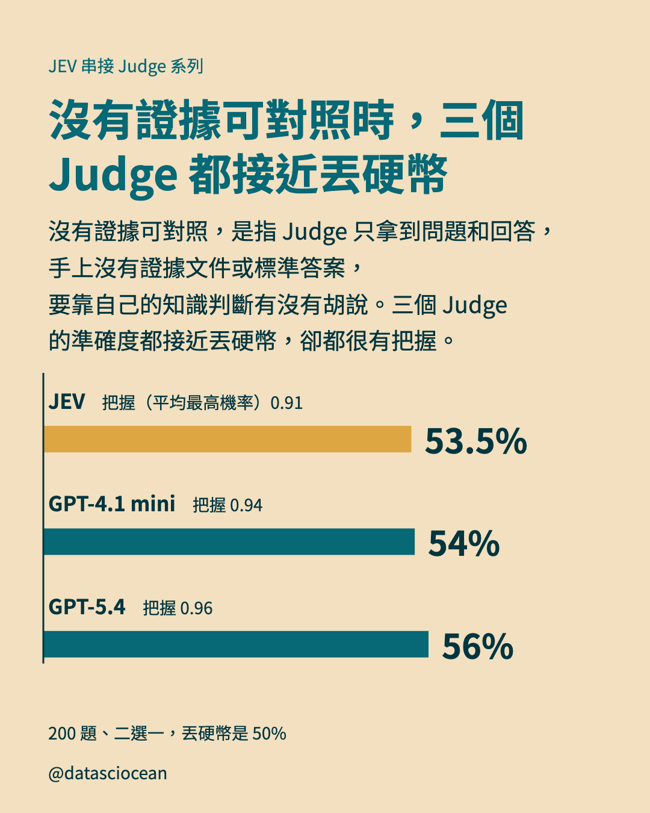
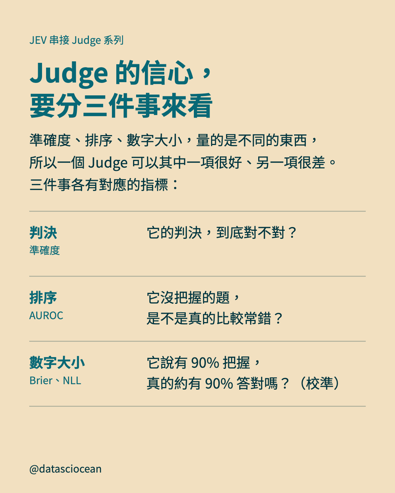
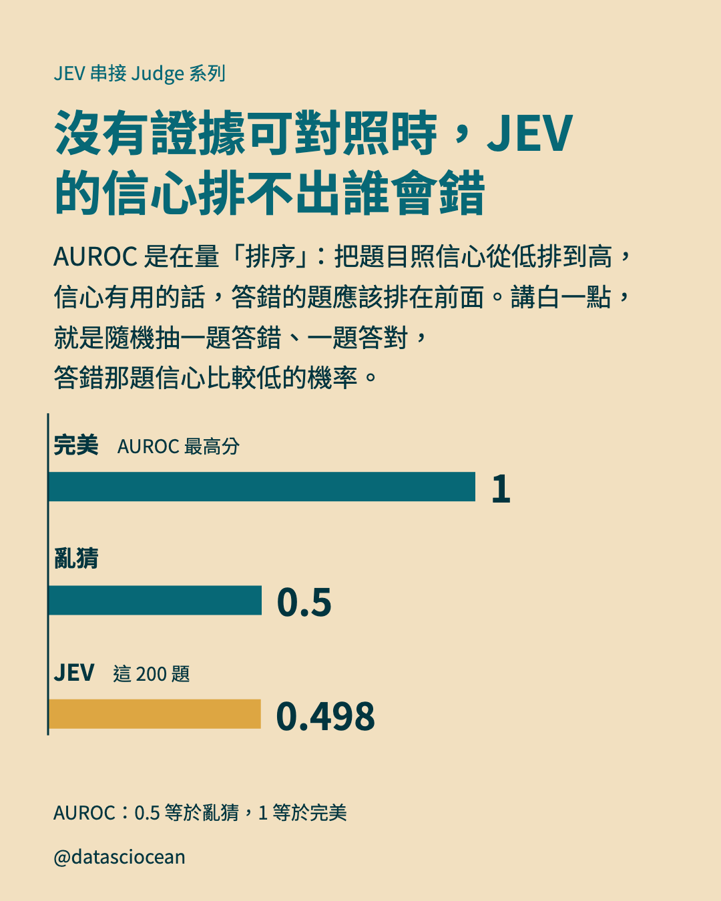
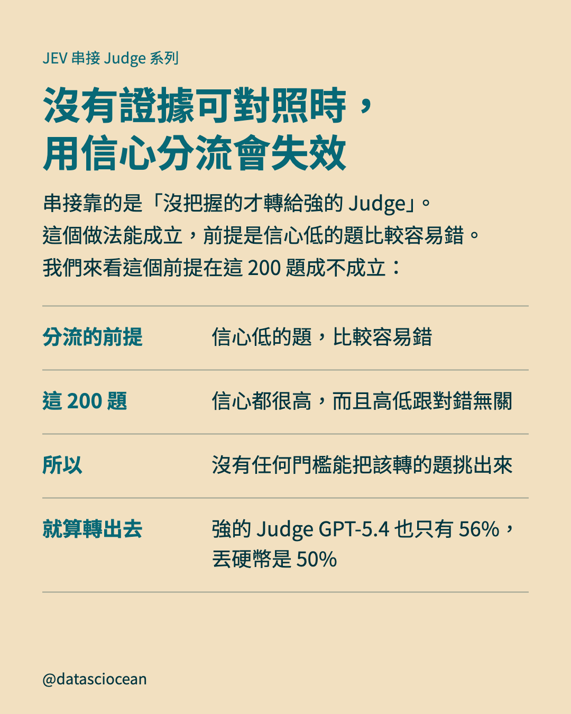

# Threads 串文：Judge 能不能用，先問答案能不能讀出來或核對

- 發文方式：正文用「新增到串文」**一次發出**，每則串文附下方標註的圖；**連結只放最後一則**（置頂）
- 圖檔在 `../ig/`（與 IG 輪播共用同一套）

## 正文

```text
便宜的 Judge JEV，判得出程式有沒有 bug 嗎？
答案讀得出來的題目，JEV 跟 GPT-6 的準確度差距在 2% 內；但像「程式」「數學」這種要自己推導的題目，就落後 12.9%、14.3%。
Judge 的工作比較像改考卷，不是把題目重做一遍。答案能直接從文字讀出，小模型就夠；需要自己重新推導才知道對錯，小模型就不及。
```

## 串文 1（附圖：第 3 頁）



```text
這則會依序看三類題目：答案讀得出來的、要自己推導的，還有手上沒有證據可以核對的。前兩類看的是便宜的 Judge 夠不夠用；第三類連強的 Judge 也會出問題。
```

## 串文 2（附圖：第 4 頁）



```text
提醒一下，這個界線是針對 JEV 1.13 版量的，新版本出來就可能移動；拿來比的 GPT-6 也只是低推理強度的設定，不是它的最強設定。
```

## 串文 3（附圖：第 5 頁）



```text
JEV 的「把握」，指的是它所有標籤機率裡最大的那一個，也就是它對自己所選判決的把握。沒有證據可核對時，Judge 仍然會給一個很有把握的答案。另外，這組只有 200 題，95% 信賴區間 [46.5, 60.5]。
```

## 串文 4（附圖：第 6 頁）



```text
用途決定你該看哪一項。只要答案，看準確度。想用信心挑出該複查的題（分流、人工覆核），看排序，而且只做分流的話，不需要校準。想把信心當成機率來讀，才要用該任務自己的標註資料另外校準。校準有點像天氣預報：說降雨機率 90% 的那些日子，真的下雨的比例也該接近 90%。
```

## 串文 5（附圖：第 7 頁）



```text
AUROC 只看順序，不看信心的大小：就算把每題的信心全部改成別的數字，只要順序不變，AUROC 就不變。所以排序和校準是兩個獨立的性質。
```

## 串文 6（附圖：第 8 頁）



```text
這不是 JEV 特有的問題：論文的結論是沒有任何受測 Judge 能用在這類題目上。上線前先用標註題量 AUROC，接近 0.5 就別用信心分流；轉出去也沒用，因為強的 Judge 也一樣近乎亂猜。要注意，這組只有 200 題，內容和標籤來源也跟有證據的那組不同，所以論文只說結果跟任務有關，不能斷言差別純粹來自有沒有證據。
```

## 最後一則（置頂）

```text
一句話帶走：用之前先想清楚你要它判哪一種題。讀得出答案，便宜的 Judge 夠用；要推導，預期大量轉給強的 Judge；沒有證據可對照，信心不可靠。
文章：datasciocean.com/paper-intro/jev-as-a-judge
同系列：串接的價值，來自兩個 Judge 錯在不同的題（尚未發布）
```
